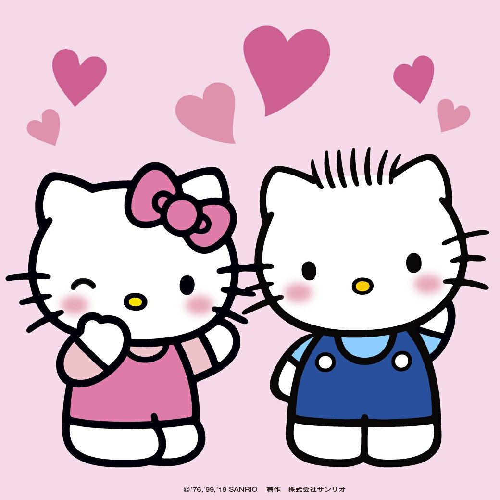

<html>
<head>
    <title>Kattie <3</title>
    <link rel="stylesheet" type="text/css" href="kattiecss.css">
    
</head>
<body>
    

        

            

                <h1>Kattie <3</h1>
                
Before I begin this is a website dedicated to Kattie and all the things we do, this is an ongoing project that I hope to keep and publish so it can be looked back on years from now. 
 
                 
                <l>One and a half years AHHHHHH!!!! I can’t believe that it has been this long, it doesn’t seem like that long ago I was sitting on the couch texting the first girl that actually seemed interested in getting to know me, I would have never guessed this is where that conversation would have gone. Now I know that this month has been busy and we didn’t get to spend much time together, but I really do hope we get more time together soon. I love you so so much silly goose. You will always be the most amazing girl in the world to me and I don’t want you to forget it.
                 
				<l>I know that you have been having some financial trouble this month and I don’t want you to worry about not being able to eat or eating very little just because you’re low on money. You can always ask me for some money to get by, I know its hard to do but I just want to help. You mean the world to me sweetheart and it’s ok to struggle just don’t forget that I’m here for you love bug. 
				 
				<l>I love you so so freaking much sweetheart happy 18 months, MWAH MWAH MWAH!

				 
				<l> 10/28/2023

                
        
